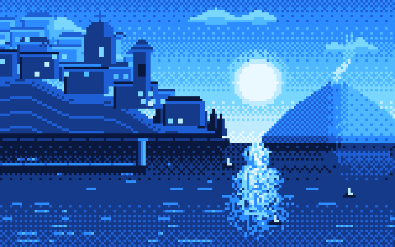

Drawn pixel by pixel in my own [PaleAle](https://lospec.com/palette-list/paleale)
palette — eight colours, no more. [Source](art/paleale_city.py).

## Yo! 🤙

# 💫 About Me

Hi, I'm **Santein** — a nostalgia tech enthusiast with a deep love for retro gaming.

I'm currently building my own arcade cabinet, blending old-school charm with modern
creativity. I'm passionate about creative coding, real-time 3D and AI, and I love
crafting visuals — pixel-perfect interfaces, generative art, interactive tech. I'm always
chasing that spark between code and creativity.

Most of what I make ends up **playable in a browser**: no installer, no launcher, just a
link. I write my own procedural audio, my own game rules engines, and I put my own
palettes on [Lospec](https://lospec.com/palette-list/paleale). Off the web I mostly live
on Apple platforms — Swift, SwiftUI, SpriteKit, Metal — building camera apps, generative
visual tools and small local-AI experiments.

What ties it all together isn't a language or a framework. It's connecting code with
design, games and culture — retro hardware, Japanese game-design history, cinema,
music — and turning that into something you can open and use.

---

# 🎮 Play My Games

Both run straight in the browser, on desktop, phone and gamepad. No install, no sign-up.

### 🌋 [VESUVIO 88 →](https://santein.github.io/Vesuvio-88/)

An endless synthwave racer set on the Gulf of Naples at sunset. Drive a DeLorean past
Mount Vesuvius, collect grapes for combos, grab a pizza for invincibility, and hit
**88 mph** for a Salto Temporale — a Back to the Future style time jump through a
hyperspace star warp. Procedurally curved roads, rival traffic, Mr. Fusion boosts,
three fully synthesised soundtracks, and a global top-5 leaderboard with arcade
three-letter initials.

*Three.js · Web Audio API · Supabase · Italian & English*

### 🃏 [The Basic Land Game →](https://santein.github.io/The-Basic-Land-Game/)

A casual **Magic: The Gathering** variant played with nothing but basic lands, as a 3D
game. There is no mana and nothing to cast — you play one land per turn, each land does
something as it lands, and you win by controlling one of each of the five types or five
of the same. The Island is the twist: discard it plus another land and you **counter**
whatever your opponent is playing, so every card in hand is a choice between building
your board and holding a defence.

Play the computer, or send a friend a link and play each other — the rules run on a
server, so neither of you can peek at a hand, know the deck order, or bluff a counter
you don't hold.

*Three.js · Supabase Edge Functions · authoritative server · shareable four-letter game codes*

---

# 💻 Tech Stack

**Languages** 
       

**Apple platforms** — my main native ecosystem 
      
also UIKit, AVFoundation, Core Motion, SwiftData, CloudKit, StoreKit, Swift Package Manager

**Games, real-time & creative coding** 
        

**AI, local models & agents** 
        
generative AI, computer vision, multimodal apps, prompt & context design, model evaluation, agentic workflows

**Web & backend** 
      

**Design & pixels** 
      

**Tools** 
    

---

## 🌐 Socials

      
